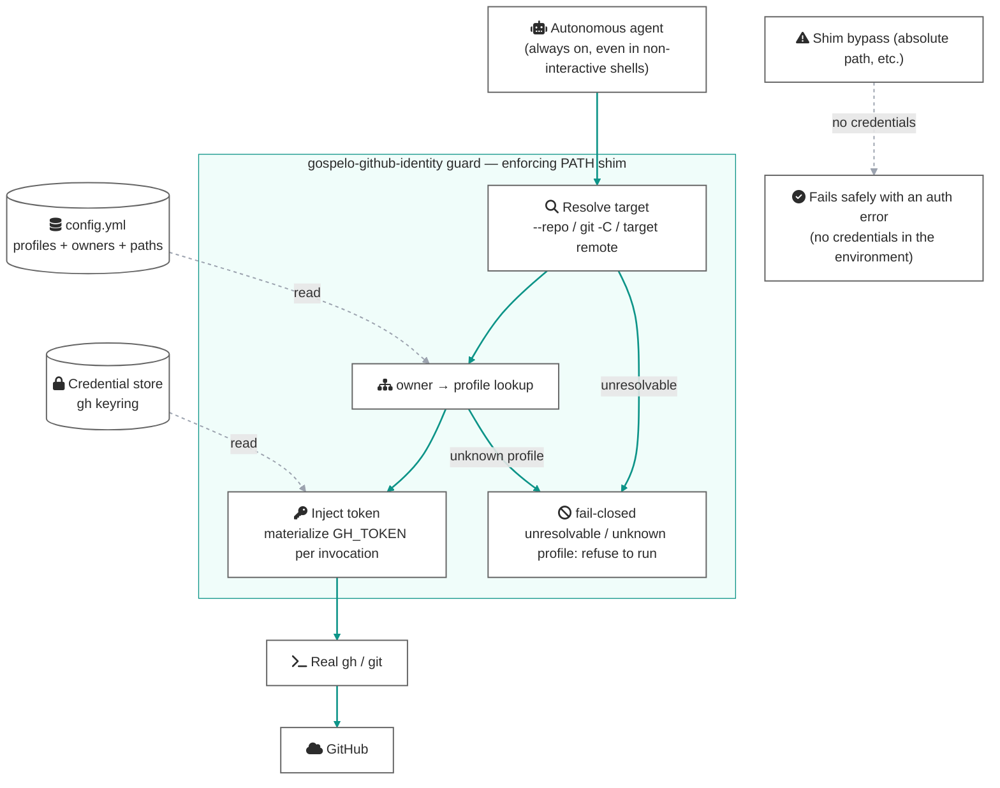

[日本語版](https://github.com/gospelo-dev/github-identity/blob/main/README_ja.md)

# gospelo-github-identity

An identity runtime for safely delegating GitHub operations to autonomous AI agents

[](https://github.com/gospelo-dev/github-identity/blob/main/LICENSE.md) [](https://www.python.org/) [](https://cli.github.com/) [](#why-gospelo-github-identity)


An identity runtime for entrusting GitHub writes — `git push`, `gh pr create`, `gh release` — to autonomously operating AI agents (Claude Code, Copilot, CI bots). It is not a convenience helper for human command-line use: it is **designed for agents operating `gh` / `git` against the outside world, safely**.

Identity is derived from the **target repository of the operation**, not from "the directory you happen to be in" (target-aware); the correct token is **injected per invocation** (enforce); and paths that do not go through the guard have **no credentials at all** (fail-closed). Because nothing depends on shell hooks or interactive prompts, it works with the same strength in an agent's non-interactive shell (`bash -c ...`) as in a human's interactive one.

## Why gospelo-github-identity?

Run an autonomous agent on a machine that juggles several GitHub accounts (personal OSS, employer, client) and human-oriented identity management collapses at its premises:

- **Agents run in non-interactive shells** — shell hooks like direnv only fire when a prompt is drawn, so `.envrc` is never evaluated under an agent's `bash -c` ([direnv/direnv#262](https://github.com/direnv/direnv/issues/262))
- **cwd and the operation target don't match** — agents run `gh --repo owner/x pr create` and `git -C /path/to/x push` from arbitrary places; cwd-based mechanisms never look at the target
- **The `gh` account is one per machine** — the active account is global state, not bound to a repository, and automatic switching based on pwd / remote is explicitly out of scope for gh itself ([cli/cli multiple-accounts.md](https://github.com/cli/cli/blob/trunk/docs/multiple-accounts.md))

The result is an accident that assembles itself while no human is watching: **a write to the right repo with the wrong account**.

### The three identity layers and how each is protected

| Layer | Where identity is bound | Protected by |
|---|---|---|
| ① git author | target repo's local `git config` | `switch` applies it; `check` / `doctor` verify it |
| ② SSH push auth | host alias in the remote URL + `IdentitiesOnly` | `doctor` audits key pinning |
| ③ gh account | **machine-global by nature** ← the hole | **guard injects a token derived from the operation target, per invocation** |

Layers ① and ② can be pinned to the target repo with standard tooling. gospelo-github-identity brings ③ into the same "**identity is bound to the target**" structure, making all three layers target-local.

### Compared with the usual approaches

| | direnv (`GH_TOKEN` injection) | `gh auth switch` | gospelo-github-identity guard |
|---|---|---|---|
| Non-interactive shells (agents) | ❌ hook never fires | — (manual) | ✅ always on via PATH shim |
| Identity derived from | cwd | machine-global | **the target repository** |
| When bypassed | ❌ global account goes through | ❌ same | ⭕ no credentials — fails safely |

## How it works

Three design principles:

1. **target-aware** — identity is derived from the `--repo` argument / `git -C` / the target repo's remote; cwd is only the last fallback
2. **enforce** — instead of inspecting and warning, the guard reverse-maps the target repo's owner to a profile and injects that profile's token as `GH_TOKEN` into the real command
3. **fail-closed** — an unresolvable target, an undeclared owner, or a bypassed shim all degrade to "refuse to run / fail with an auth error", never to "succeed with the wrong identity"


<details><summary>Diagram source (Mermaid)</summary>



</details>

Dashed arrows are reads or bypass paths; solid arrows are the enforced flow that leads to a write. Fail-closed is the keystone: the PATH shim can be bypassed with an absolute path, but if no `GH_TOKEN` lives in the environment (no direnv needed) and no global active account is kept, **there are no credentials on the far side of the bypass** — so a bypass degrades into an auth error, not a success under the wrong account. `doctor` audits that this discipline is being maintained.

## Installation

```bash
uv tool install gospelo-github-identity
```

Requires `uv` and Python 3.11+, with `git` and the [`gh` CLI](https://cli.github.com/) on `PATH`. Do not invoke the package with `python -m`.

## Quick start — four steps before handing the keys to an agent

A human runs the setup once; from then on the machine stays in a state agents can operate safely:

```bash
# 1. Create the config interactively (declare profiles / paths / owners)
gospelo-github-identity init

# 2. Audit the setup and the fail-closed state
#    (bare remotes, aliases with no pinned key, GH_TOKEN lingering in the env ...)
gospelo-github-identity doctor --sweep

# 3. Install the guard (shadow gh / git with PATH shims)
gospelo-github-identity install-guard --tools gh,git
export PATH="$HOME/.gospelo-github-identity/bin:$PATH"   # add to ~/.zshrc / ~/.bashrc

# 4. Verify — identity is selected from the target repo, from any cwd
gospelo-github-identity check
gh --repo <owner>/<repo> repo view   # runs with the token of the profile that owns <owner>
```

No agent-side configuration is needed (the PATH shim intercepts every `gh` / `git` call). To layer an additional pre-write check on the agent itself, install the [agent skills](#agent-skills).

### Optional: Git commit hook

To automatically remove `Co-Authored-By` trailers from commit messages, install the global Git hook. Use the CLI installed through `uv tool`.

```bash
gospelo-github-identity install-commit-hook
git config --global --get core.hooksPath
```

To remove it:

```bash
gospelo-github-identity uninstall-commit-hook
```

This uses Git's `core.hooksPath`. A repository-specific `core.hooksPath` (for example, from husky) takes precedence over the global setting. In that case, add `gospelo-github-identity strip-coauthors` to that repository's hook configuration instead.

## CLI commands

| Command | Description |
|---------|-------------|
| `init` | Interactively create `~/.config/gospelo-github-identity/config.yml` |
| `list` | List registered profiles as a table |
| `detect` | Print the profile that applies to the current directory |
| `check` | Compare expected vs. live state (`git config` / `gh` CLI) |
| `doctor` | Audit the *health* of the setup: identity scope/values, remote + SSH alias key pinning, **ambient credentials (lingering `GH_TOKEN` / `GITHUB_TOKEN`)**. `--sweep` audits a profile's whole tree |
| `switch <profile>` | One-shot manual application of a profile's git config |
| `prompt` | Shell-prompt integration helper (`--format=ps1` / `plain` / `color`) |
| `install-guard` / `uninstall-guard` | Shadow `gh` / `git` with PATH shims that enforce target-repo-based identity |
| `install-commit-hook` / `uninstall-commit-hook` | Global `commit-msg` hook that strips `Co-Authored-By` trailers |

See the [CLI reference](https://github.com/gospelo-dev/github-identity/blob/main/docs/manual/en/cli-reference.md) for details.

## Configuration

In `~/.config/gospelo-github-identity/config.yml`, declare profiles so they can be resolved from both directories (paths) and **GitHub owners (owners)**. **`owners` is the linchpin of target-aware enforcement** — the guard takes the owner from `gh --repo` or the target repo's remote and reverse-maps it to a profile:

```yaml
version: "1"

profiles:
  oss:
    description: "Personal OSS work"
    git:
      user.name: your-oss-login
      user.email: you@example.com
    gh:
      account: your-oss-login
      owners: [your-oss-login, your-oss-org]   # writes to these owners use this identity
    paths:                                      # cwd fallback (for operations with no repo target)
      - ~/projects/oss/**

  work:
    description: "Company work"
    git:
      user.name: your-oss-login
      user.email: you@company.com
    gh:
      account: your-work-login
      owners: [your-company-org]
    paths:
      - ~/projects/work/**
```

Target resolution order: the `--repo owner/name` argument → the remote of the repo given to `git -C <path>` → the cwd's remote → (only for operations with no repo target) the cwd's `paths` match. **A write whose profile cannot be resolved by any of these is not executed** (fail-closed). `GOSPELO_GITHUB_IDENTITY_SKIP=1` bypasses the guard once, explicitly; `GOSPELO_GITHUB_IDENTITY_QUIET=1` suppresses status output.

Sample configs live in [examples/](https://github.com/gospelo-dev/github-identity/tree/main/examples); the schema is documented in the [config format reference](https://github.com/gospelo-dev/github-identity/blob/main/docs/manual/en/config-format.md).

## Assumptions and limits (an honest line)

- What it protects against is **accidental** wrong identity. Defense against adversarial processes is the job of OS sandboxing, outside this tool's scope
- Push authentication holds together with an **SSH workflow** (host-aliased remotes + `IdentitiesOnly yes`). `doctor` detects bare `git@github.com` remotes and aliases with no pinned key
- Token injection assumes each account is logged into the keyring via `gh auth login` (missing logins are caught by `doctor`)
- A process that reads the credential store directly cannot be stopped (→ the territory of OS sandboxes / dedicated users)

## Troubleshooting

### The guard blocks a write (`unknown owner`)

The target repo's owner is not declared in any profile's `owners`. This is fail-closed working as intended. Add the owner to the right profile in your config — or, for a deliberate one-off, run with `GOSPELO_GITHUB_IDENTITY_SKIP=1`.

### `switch` says "OK" but the live identity is another account (stale keyring credentials)

`gh auth switch` only flips the active label in `hosts.yml`; it never re-validates the token. The real identity is **`gh api user`** (the account the token actually belongs to). `check` has always compared against the real token, and `switch` verifies at the token level after switching — on mismatch it reports `NG ... keyring mismatch` and exits non-zero. Fix:

```bash
gh auth logout --hostname github.com --user <account>
gh auth login  --hostname github.com          # authenticate in the browser as <account>
gospelo-github-identity check
```

### `no profile matched`

An operation with no repo target, and the cwd matches no profile's `paths`. Add a matching glob or set `default_profile`.

## Exit codes

| Code | Meaning |
|---|---|
| `0` | Success / match |
| `1` | Expected condition not met (mismatch / refusal by fail-closed / no matching profile, etc.) |
| `2` | Tool error (missing config, invalid YAML, external tool failure, etc.) |

## Documentation

- [Quick start](https://github.com/gospelo-dev/github-identity/blob/main/docs/manual/en/quick-start.md)
- [CLI reference](https://github.com/gospelo-dev/github-identity/blob/main/docs/manual/en/cli-reference.md)
- [Config format](https://github.com/gospelo-dev/github-identity/blob/main/docs/manual/en/config-format.md)
- [Shell integration](https://github.com/gospelo-dev/github-identity/blob/main/docs/manual/en/shell-integration.md)
- [Architecture design (enforce + fail-closed)](https://github.com/gospelo-dev/github-identity/blob/main/docs/architecture/enforce-fail-closed.md)

The Japanese manual lives in [`docs/manual/ja/`](https://github.com/gospelo-dev/github-identity/tree/main/docs/manual/ja) (see also [README_ja.md](https://github.com/gospelo-dev/github-identity/blob/main/README_ja.md)).

## Agent skills

On top of the guard (the enforcement layer), these skills add a defense-in-depth check the agent runs on itself: `gospelo-github-identity check` fires automatically **before write operations** — `git push`, PR creation, releases, package publishing — and stops the operation on mismatch. See [`skills/README.md`](https://github.com/gospelo-dev/github-identity/blob/main/skills/README.md).

- [Claude Code skill](https://github.com/gospelo-dev/github-identity/tree/main/skills/claude) — install under `.claude/skills/gospelo-github-identity-check/`
- [GitHub Copilot skill](https://github.com/gospelo-dev/github-identity/tree/main/skills/copilot) — install under `.github/copilot/skills/gospelo-github-identity-check/` (subject to change as Copilot's skill spec evolves)

## License

MIT — free to use, including commercially. You own the copyright of any `config.yml` you write. See [LICENSE.md](https://github.com/gospelo-dev/github-identity/blob/main/LICENSE.md) for details.
