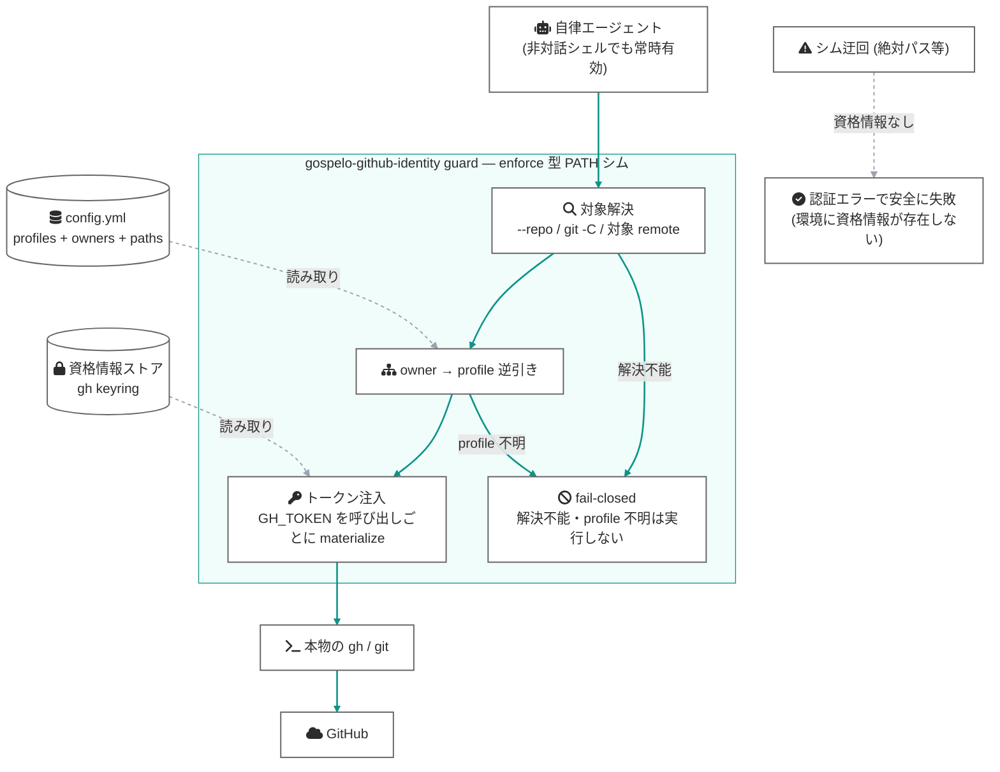

[English](https://github.com/gospelo-dev/github-identity/blob/main/README.md)

# gospelo-github-identity

自律エージェントに GitHub 操作を安全に任せるための identity 実行基盤

[](https://github.com/gospelo-dev/github-identity/blob/main/LICENSE.md) [](https://www.python.org/) [](https://cli.github.com/) [](#なぜ-gospelo-github-identity)


自律稼働する AI エージェント (Claude Code、Copilot、CI ボット) に GitHub への書き込み — `git push`、`gh pr create`、`gh release` — を任せるための identity 実行基盤。人間のコマンド操作の補助ツールではなく、**エージェントによる `gh` / `git` の外部操作を安全に行うことを目的として設計**されています。

identity は「今いるディレクトリ」ではなく**操作対象の repo** から導出され (target-aware)、正しいトークンが**呼び出しごとに注入**され (enforce)、ガードを通らない経路には**資格情報そのものが存在しません** (fail-closed)。シェルフックにも対話プロンプトにも依存しないため、エージェントの非対話シェル (`bash -c ...`) でも人間の対話シェルと同じ強度で機能します。

## なぜ gospelo-github-identity？

複数の GitHub アカウント (個人 OSS、勤務先、クライアント) を使い分けるマシンで自律エージェントを走らせると、人間向けの identity 管理は前提から崩れます:

- **非対話シェルで動く** — direnv 等のシェルフックはプロンプト表示時にしか発火せず、エージェントの `bash -c` では `.envrc` が評価されない ([direnv/direnv#262](https://github.com/direnv/direnv/issues/262))
- **cwd と操作対象が一致しない** — エージェントは `gh --repo owner/x pr create` や `git -C /path/to/x push` を任意の場所から実行する。cwd 基準の仕組みは対象を見ていない
- **`gh` のアカウントはマシン全体で 1 つ** — active account はグローバル状態で、repo には紐づかない。pwd / remote に基づく自動切替は gh 公式が明示的にスコープ外 ([cli/cli multiple-accounts.md](https://github.com/cli/cli/blob/trunk/docs/multiple-accounts.md))

結果、**「正しい repo に、間違ったアカウントで書き込む」**事故が、人間が見ていないところで成立します。

### identity 3 層と守り方

| 層 | identity の束縛先 | 守る仕組み |
|---|---|---|
| ① git 著者名 | 対象 repo の local `git config` | `switch` が適用、`check` / `doctor` が検証 |
| ② SSH push 認証 | remote URL のホストエイリアス + `IdentitiesOnly` | `doctor` が鍵固定を監査 |
| ③ gh アカウント | **本来はマシングローバル** ← ここが穴 | **guard が操作対象から導出したトークンを呼び出しごとに注入** |

①② は標準の仕組みで対象 repo に固定できます。gospelo-github-identity は ③ を ①② と同じ「**対象に identity が紐づく**」構造に揃え、3 層すべてを target-local にします。

### 従来手法との比較

| | direnv (`GH_TOKEN` 注入) | `gh auth switch` | gospelo-github-identity guard |
|---|---|---|---|
| 非対話シェル (エージェント) | ❌ フック不発 | — (手動) | ✅ PATH シムで常時 |
| identity の基準 | cwd | マシングローバル | **操作対象の repo** |
| 迂回されたとき | ❌ グローバル account で通る | ❌ 同左 | ⭕ 資格情報がなく安全に失敗 |

## 仕組み

設計原則は 3 つ:

1. **target-aware** — identity を `--repo` 引数 / `git -C` / 対象 repo の remote から導出する。cwd は最後のフォールバック
2. **enforce** — 検査して警告するのではなく、対象 repo の owner から profile を逆引きし、その profile のトークンを `GH_TOKEN` として本物のコマンドに注入する
3. **fail-closed** — 対象を解決できない・owner が未宣言・シムを迂回された、のいずれも「誤 identity で成功」ではなく「実行拒否 / 認証エラーで失敗」に落ちる


<details><summary>図のソース (Mermaid)</summary>



</details>

破線は読み取りまたは迂回経路、実線は書き込みに至る強制フローを表します。fail-closed が要石です: PATH シムは絶対パス実行で迂回できますが、環境に `GH_TOKEN` を常駐させず (direnv 不要)、グローバル active account も持たない運用にすると、**迂回した先に資格情報がない**ため、迂回は「誤アカウントでの成功」ではなく「認証エラー」に落ちます。この運用が保たれているかは `doctor` が監査します。

## インストール

```bash
uv tool install gospelo-github-identity
```

`uv` と Python 3.11+ が必要です。`git` および [`gh` CLI](https://cli.github.com/) が `PATH` 上にあること。`python -m` による直接起動は行わないでください。

## クイックスタート — エージェントに任せる前の 4 ステップ

セットアップは人間が 1 回だけ行い、以後はエージェントが安全に操作できる状態を維持します:

```bash
# 1. config を対話的に作成 (profile / paths / owners を宣言)
gospelo-github-identity init

# 2. 設定と fail-closed 状態を監査
#    (素の remote、鍵固定のないエイリアス、環境に常駐する GH_TOKEN ...)
gospelo-github-identity doctor --sweep

# 3. guard をインストール (gh / git を PATH シムでシャドウ)
gospelo-github-identity install-guard --tools gh,git
export PATH="$HOME/.gospelo-github-identity/bin:$PATH"   # ~/.zshrc / ~/.bashrc に追記

# 4. 動作確認 — 任意の cwd から、対象 repo 基準で identity が選ばれる
gospelo-github-identity check
gh --repo <owner>/<repo> repo view   # owner に対応する profile のトークンで実行される
```

エージェント側には追加設定は不要です (PATH シムがすべての `gh` / `git` 呼び出しを捕捉)。さらに書き込み前チェックを重ねたい場合は [エージェントスキル](#エージェントスキル) を配置してください。

### 任意: Gitコミットフック

コミットメッセージから `Co-Authored-By` と `Claude-Session` を除去し、内容確認のためリトライを求める場合は、グローバルGitフックをインストールします。CLIは `uv tool` でインストールしたものを使用してください。

```bash
gospelo-github-identity install-commit-hook
git config --global --get core.hooksPath
```

解除する場合:

```bash
gospelo-github-identity uninstall-commit-hook
```

この設定はGitの `core.hooksPath` を使用します。リポジトリ側で独自の `core.hooksPath` (husky等) を設定している場合は、リポジトリ側の設定が優先されます。その場合は対象リポジトリのフック構成へ `gospelo-github-identity strip-coauthors` を個別に組み込んでください。

## CLI コマンド一覧

| コマンド | 説明 |
|----------|------|
| `init` | `~/.config/gospelo-github-identity/config.yml` を対話的に作成 |
| `list` | 登録済み profile をテーブル表示 |
| `detect` | 現在ディレクトリで適用される profile 名を出力 |
| `check` | 期待 vs 実状態 (`git config` / `gh` CLI) を比較 |
| `doctor` | 設定の*健全性*を監査: identity のスコープ/値、remote + SSH エイリアスの鍵固定、**ambient credential (常駐 `GH_TOKEN` / `GITHUB_TOKEN`)**。`--sweep` で profile ツリー全体 |
| `switch <profile>` | 指定 profile の git config を手動適用する一発コマンド |
| `prompt` | シェルプロンプト統合用 helper (`--format=ps1` / `plain` / `color`) |
| `install-guard` / `uninstall-guard` | `gh` / `git` を PATH シムでシャドウし、対象 repo 基準の identity を強制 |
| `install-commit-hook` / `uninstall-commit-hook` | 禁止トレーラを除去してリトライを求めるグローバル `commit-msg` フック |

詳細は [CLI リファレンス](https://github.com/gospelo-dev/github-identity/blob/main/docs/manual/ja/cli-reference.md) を参照。

## 設定ファイル

`~/.config/gospelo-github-identity/config.yml` に、ディレクトリ (paths) と **GitHub owner (owners)** の両方から profile を引けるよう宣言します。**owners が target-aware 強制の要**です — `gh --repo` や対象 repo の remote から owner を取り、profile を逆引きします:

```yaml
version: "1"

profiles:
  oss:
    description: "Personal OSS work"
    git:
      user.name: your-oss-login
      user.email: you@example.com
    gh:
      account: your-oss-login
      owners: [your-oss-login, your-oss-org]   # この owner への write はこの identity
    paths:                                      # cwd フォールバック用 (対象を持たない操作)
      - ~/projects/oss/**

  work:
    description: "Company work"
    git:
      user.name: your-oss-login
      user.email: you@company.com
    gh:
      account: your-work-login
      owners: [your-company-org]
    paths:
      - ~/projects/work/**
```

対象解決の優先順位: `--repo owner/name` 引数 → `git -C <path>` の対象 repo の remote → cwd の remote → (repo 対象を持たない操作のみ) cwd の `paths` マッチ。**どの手段でも profile を引けない書き込みは実行されません** (fail-closed)。`GOSPELO_GITHUB_IDENTITY_SKIP=1` で 1 回だけ明示バイパス、`GOSPELO_GITHUB_IDENTITY_QUIET=1` でステータス出力を抑制できます。

サンプル設定は [examples/](https://github.com/gospelo-dev/github-identity/tree/main/examples) に、スキーマの詳細は [設定ファイル仕様](https://github.com/gospelo-dev/github-identity/blob/main/docs/manual/ja/config-format.md) にあります。

## 前提と限界 (正直な線引き)

- 守るのは **accidental** な誤 identity です。敵対的プロセスへの防御は OS サンドボックスの役割で、本ツールのスコープ外です
- push 認証は **SSH 運用** (remote のホストエイリアス + `IdentitiesOnly yes`) と組み合わせて成立します。`doctor` が素の `git@github.com` remote や鍵固定のないエイリアスを検出します
- トークン注入は各アカウントが `gh auth login` で keyring にログイン済みであることが前提です (未ログインは `doctor` が検出)
- 資格情報ストア自体を直接読むプロセスは防げません (→ OS サンドボックス / 専用ユーザーの領域)

## トラブルシューティング

### guard が書き込みをブロックする (`unknown owner`)

対象 repo の owner がどの profile の `owners` にも宣言されていません。fail-closed の正常動作です。config の該当 profile に owner を追加するか、意図的な 1 回なら `GOSPELO_GITHUB_IDENTITY_SKIP=1` を付けて実行してください。

### `switch` は「OK」なのに実 identity が別アカウント (keyring の認証情報が古い)

`gh auth switch` は `hosts.yml` の active ラベルを切り替えるだけで、トークンの再検証はしません。真の identity は **`gh api user`** (トークンが実際に属するアカウント) です。`check` は元から実トークンで照合し、`switch` も切替後にトークンレベルで検証して不一致なら `NG ... keyring mismatch` で非ゼロ終了します。対処:

```bash
gh auth logout --hostname github.com --user <account>
gh auth login  --hostname github.com          # <account> でブラウザ認証
gospelo-github-identity check
```

### `no profile matched`

repo 対象を持たない操作で、cwd がどの profile の `paths` にも該当していません。マッチする glob を追加するか、`default_profile` を設定してください。

## 終了コード

| コード | 意味 |
|---|---|
| `0` | 成功 / 一致 |
| `1` | 期待条件未達 (ミスマッチ / fail-closed による実行拒否 / 該当 profile なし 等) |
| `2` | ツールエラー (config 未作成、不正な YAML、外部ツール失敗 等) |

## ドキュメント

- [クイックスタート](https://github.com/gospelo-dev/github-identity/blob/main/docs/manual/ja/quick-start.md)
- [CLI リファレンス](https://github.com/gospelo-dev/github-identity/blob/main/docs/manual/ja/cli-reference.md)
- [設定ファイル仕様](https://github.com/gospelo-dev/github-identity/blob/main/docs/manual/ja/config-format.md)
- [シェル統合ガイド](https://github.com/gospelo-dev/github-identity/blob/main/docs/manual/ja/shell-integration.md)
- [アーキテクチャ設計 (enforce + fail-closed)](https://github.com/gospelo-dev/github-identity/blob/main/docs/architecture/enforce-fail-closed_ja.md)

英語マニュアルは [`docs/manual/en/`](https://github.com/gospelo-dev/github-identity/tree/main/docs/manual/en) にあります ([README.md](https://github.com/gospelo-dev/github-identity/blob/main/README.md) も参照)。

## エージェントスキル

guard (強制層) に加えて、エージェント自身に書き込み前チェックをさせる多層防御用スキル。`git push` / PR 作成 / リリース / パッケージ公開などの**書き込み系操作の前**に `gospelo-github-identity check` を自動実行し、ミスマッチ時は操作を停止します。詳細は [`skills/README.md`](https://github.com/gospelo-dev/github-identity/blob/main/skills/README.md) を参照。

- [Claude Code スキル](https://github.com/gospelo-dev/github-identity/tree/main/skills/claude) — `.claude/skills/gospelo-github-identity-check/` 配下に配置
- [GitHub Copilot スキル](https://github.com/gospelo-dev/github-identity/tree/main/skills/copilot) — `.github/copilot/skills/gospelo-github-identity-check/` 配下に配置 (Copilot のスキル仕様により変更の可能性あり)

## ライセンス

MIT — 商用利用を含め自由に利用できます。ユーザーが作成した `config.yml` の著作権はユーザーに帰属します。詳細は [LICENSE_ja.md](https://github.com/gospelo-dev/github-identity/blob/main/LICENSE_ja.md) を参照。
