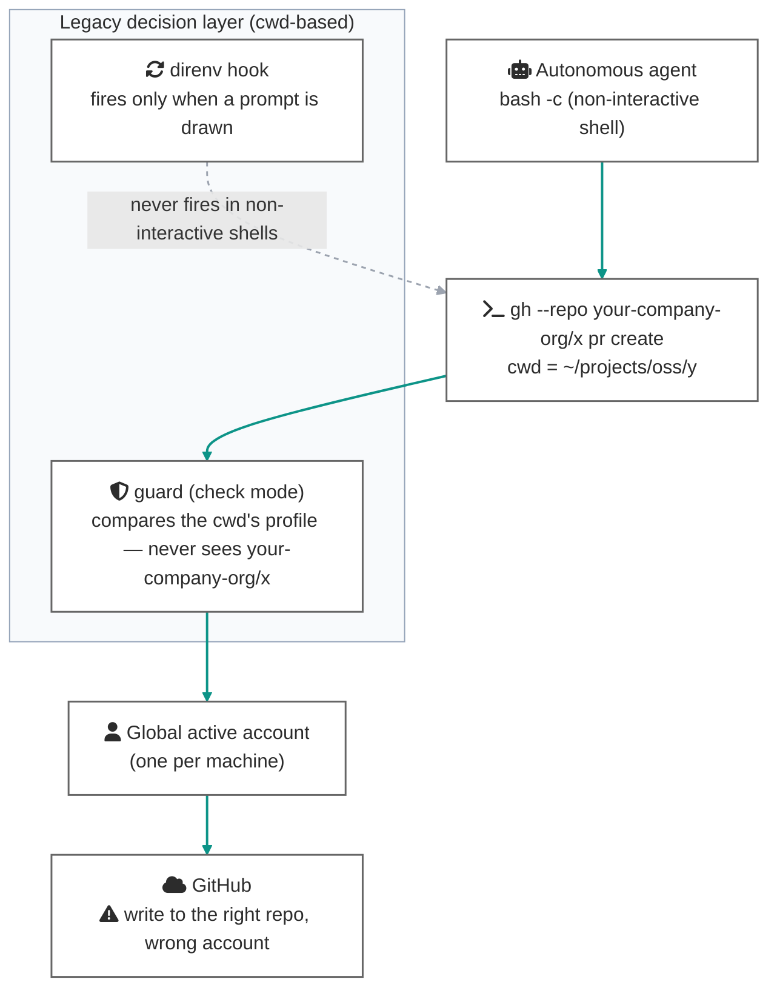
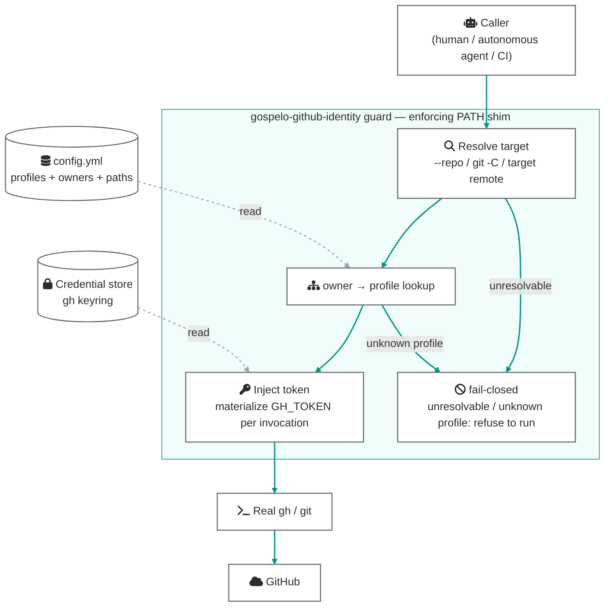
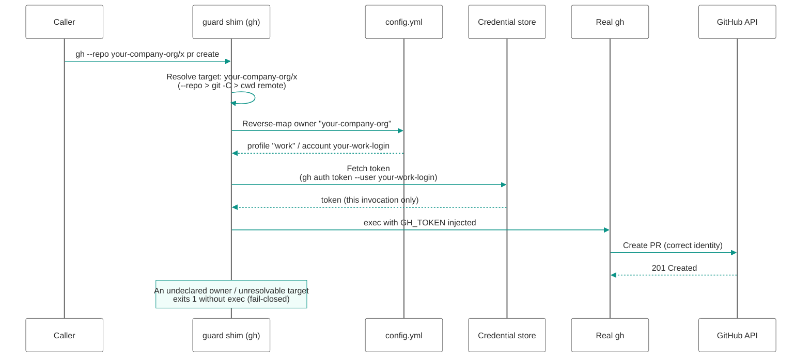
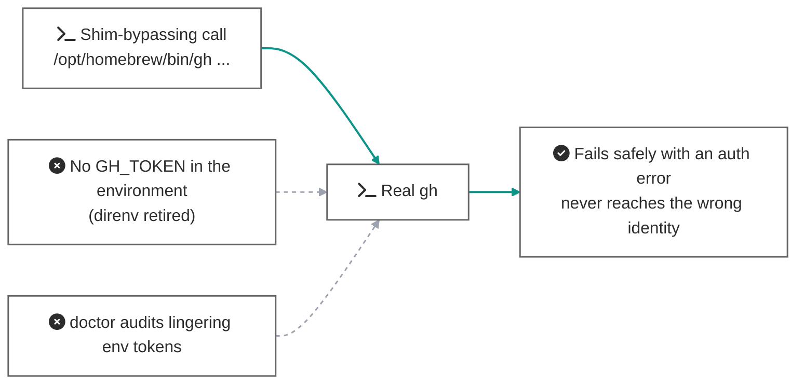

# The enforce + fail-closed architecture

[日本語版](enforce-fail-closed_ja.md)

> **Status: implemented (v0.2.0)** — this document records the background and reasoning behind promoting the guard from "check mode" to "enforce mode". For the precise reference of the implemented behavior, see [docs/manual/en/enforcement.md](../manual/en/enforcement.md). The scope boundary — identity only, no general-purpose command firewall — is maintained.
>
> Account names (`your-oss-login` / `your-work-login`) and org names (`your-company-org`) in the examples are placeholders.

## 1. Background — two structural defects of relying on direnv

Up to v0.1.x, the standard recipe delegated automatic `gh` account switching to direnv (injecting `GH_TOKEN` from `.envrc`). That approach has two structural defects, both confirmed by primary sources:

1. **It does not fire in non-interactive shells.** direnv runs from a prompt-time shell hook, so `.envrc` is never evaluated under an autonomous agent's `bash -c ...` (no rc files read) ([direnv/direnv#262](https://github.com/direnv/direnv/issues/262), [direnv man](https://direnv.net/man/direnv.1.html)).
2. **It is cwd-based, not target-based.** Operate on a different repo via `gh --repo <owner>/<repo>` or `git -C <path>` and both direnv and a check-mode guard apply the *cwd's* identity.

Moreover, gh itself explicitly scopes out "automatic account switching based on pwd / git remote" ([cli/cli multiple-accounts.md](https://github.com/cli/cli/blob/trunk/docs/multiple-accounts.md)); the active account is one piece of machine-global state. gospelo-github-identity fills this gap.

### The three identity layers

| Layer | Where identity is bound | Behavior when cwd diverges |
|---|---|---|
| ① git author | target repo's local `git config` | ✅ safe (`git -C X` reads X's config — [git docs](https://git-scm.com/docs/git)) |
| ② SSH push auth | host alias in the target repo's remote URL + `IdentitiesOnly` | ✅ safe (key selection reads only the remote URL) |
| ③ gh account | **environment-global** (`GH_TOKEN` env / active account — [gh env manual](https://cli.github.com/manual/gh_help_environment)) | ❌ **the hole** — a write to the right repo with the wrong account |

The goal of this design: bring **③ into the same "identity bound to the target" structure as ① and ②**.

### The pre-0.2.0 hole (cwd-based + direnv-dependent)



## 2. Design principles

1. **target-aware** — identity derives from the **target of the operation** (`--repo` / `git -C` / the target repo's remote), not the cwd.
2. **non-ambient** — no credentials parked in environment variables. Tokens are materialized per invocation and exist only in that single process's environment, for a moment.
3. **fail-closed** — an unresolvable target, an unmappable profile, or a bypassed shim all degrade to "no credentials / refuse to run", never to "succeed under the wrong identity".

Principle 3 is the keystone: a PATH shim can be bypassed (absolute-path execution, direct API calls), but **if no credentials exist on the far side of the bypass**, the bypass falls into "a safe failure" instead of "a success under the wrong account". Instead of chasing exhaustive interception, remove the credentials from the paths that skip inspection.

## 3. Architecture overview

The guard is promoted from "inspect and warn" (check mode) to "inject identity" (enforce mode); direnv becomes retirable (the prompt-hook dependency disappears).



## 4. Data flows

### 4.1 A gh write on the happy path (target-aware injection)

How `gh --repo your-company-org/x pr create` runs under the right identity even from an unrelated cwd:



### 4.2 A bypassed shim (fail-closed)

Even when the shim is bypassed — absolute-path execution, a direct call from a script — no credentials exist in the environment, so "success under the wrong identity" is unreachable:



## 5. Hole inventory — check mode vs. enforce mode

| Path | Check mode (with direnv, ~v0.1.x) | Enforce mode (v0.2.0+) |
|---|---|---|
| `gh` write from a non-interactive shell | ❌ direnv never fires; passes | ✅ the shim always enforces on PATH-based calls |
| cwd divergence (`gh --repo X` / `git -C X`) | ❌ judged by the cwd | ✅ resolved from the target |
| Operation from an ungoverned cwd | ❌ no profile, no guard | ✅ enforced when the target is governed; refused when unknown |
| Shim bypass via absolute path | ❌ goes through under the global account | ⭕ no credentials — auth error (fails safe) |
| Operations with no inferable target (`gh gist create`, `gh api /user`, ...) | — | ✅ falls back to the cwd's profile; refused when ungoverned |
| A process reading the credential store directly | — | ⚠️ residual risk — the territory of OS sandboxes / dedicated users (out of scope) |

Layers ① (git author) and ② (SSH keys) were already target-local; this design leaves them unchanged.

## 6. Components

| Component | Role |
|---|---|
| `guard.py` | Target resolution (`--repo` / `-C` / target remote) + owner→profile lookup + token injection + fail-closed |
| `config.py` | The `owners:` list under a profile's `gh:` (the owner→profile reverse map) |
| `doctor.py` | Fail-closed hygiene checks: no `GH_TOKEN` / `GITHUB_TOKEN` parked in the environment |
| direnv (`.envrc`) | Retired (removed from the recommended setup) |
| `switch` | Unchanged (still the one-shot manual application command) |

### 6.1 Config (the owners map)

```yaml
profiles:
  oss:
    git:
      user.name: your-oss-login
      user.email: you@example.com
    gh:
      account: your-oss-login
      owners: [your-oss-org, your-oss-login]   # writes to these owners use this identity
    paths:
      - ~/projects/oss/**
```

Target resolution order: the `--repo owner/name` argument → the remote of the repo given to `git -C <path>` → the cwd's remote. An owner found in no profile's `owners` is **not executed** (fail-closed).

### 6.2 Materializing the token

`gh auth token --user <account>` extracts the mapped profile's token, injected as `GH_TOKEN` into the real gh's execution environment only ([the mechanism gh's own docs](https://github.com/cli/cli/blob/trunk/docs/multiple-accounts.md) point automated switching solutions at). `GH_TOKEN` outranks stored credentials, so the invocation runs under the right identity regardless of the global active account.

### 6.3 Removing ambient credentials (what makes fail-closed hold)

- Keep no `GH_TOKEN` / `GITHUB_TOKEN` parked in the shell environment (achieved automatically by retiring direnv)
- This establishes "paths that skip the shim find no credentials"
- `doctor` audits the discipline (a lingering env token is a WARN)

### 6.4 Policy for operations with no inferable target

Operations without a repo target (`gh gist create`, `gh api /user`, ...) cannot be reverse-mapped by owner. The default falls back to the cwd's profile; when the cwd is ungoverned too, the write is refused (`GOSPELO_GITHUB_IDENTITY_SKIP=1` remains the explicit bypass).

## 7. Migration path

1. **Phase A — target-aware check**: move the guard's criterion from cwd to the target (non-breaking precision fix)
2. **Phase B — token injection**: check mode → enforce mode; the right identity gets selected without direnv
3. **Phase C — ambient removal**: retire direnv + `doctor`'s fail-closed diagnostics

Phases A/B are backward compatible (the guard stays in check mode until `gh.owners` is declared). Fail-closed holds once Phase C completes.

## 8. Residual risks and limits (an honest line)

- **Direct access to the credential store** cannot be prevented. Defense against adversarial processes is the job of OS sandboxing; this design protects against **accidental** wrong identity.
- HTTPS git authentication through gh's credential helper presumes global auth, so the design holds together with an **SSH push workflow** (aliased remotes + `IdentitiesOnly`).
- `gh auth token --user` presumes the account is logged into the keyring. Missing logins are caught by `doctor`, and the guard refuses writes it cannot inject.
- Logged-in keyring accounts themselves remain (gh always marks one of them active), so doctor's ambient audit is limited to environment variables (`GH_TOKEN` / `GITHUB_TOKEN`).
