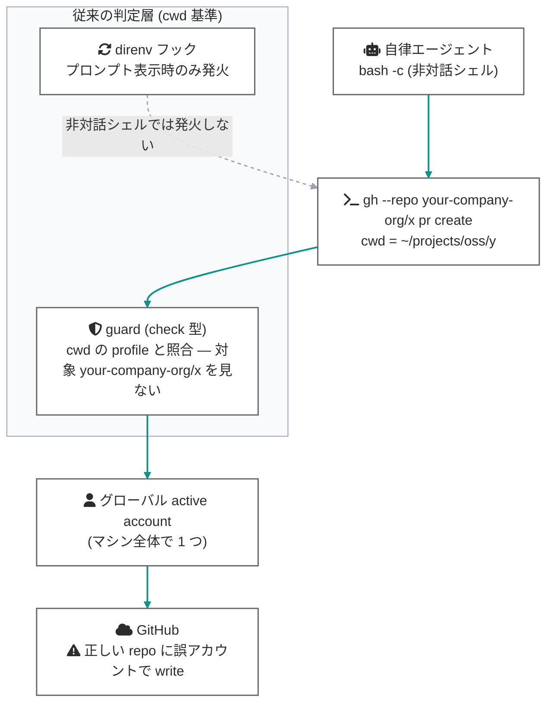
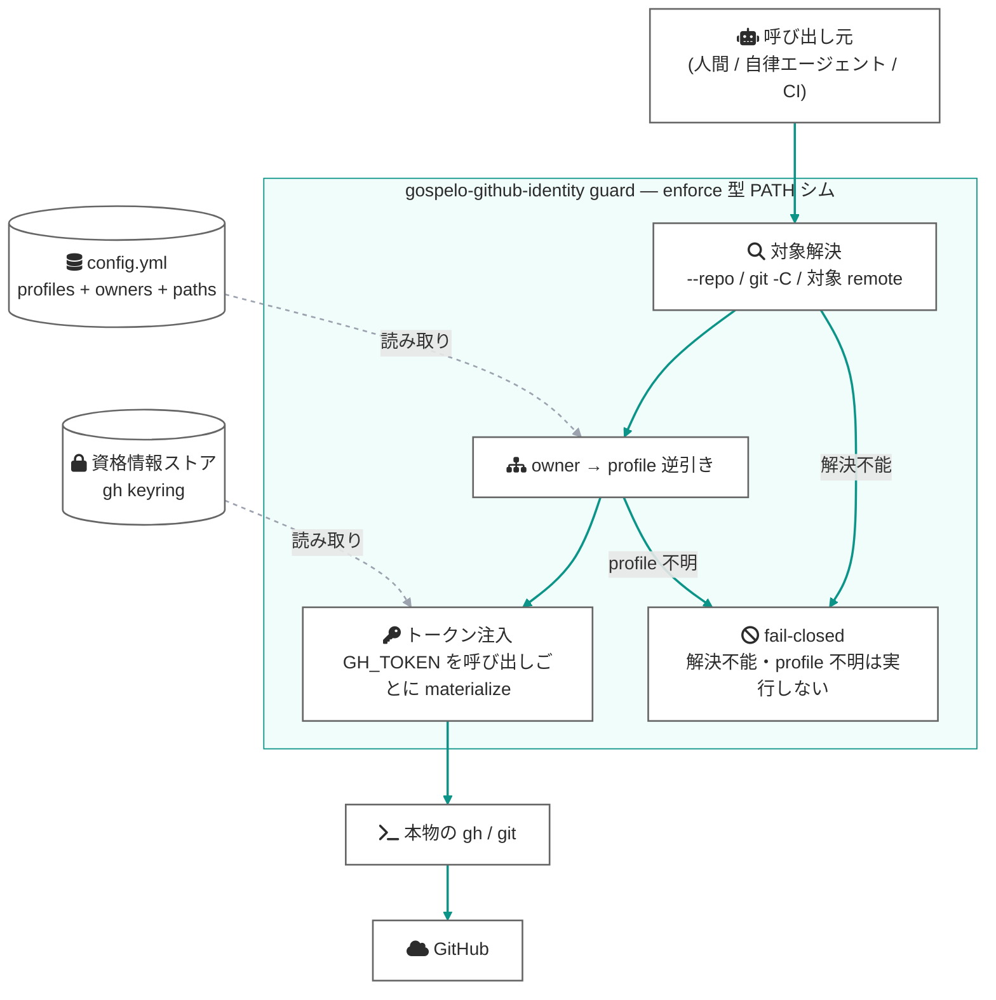
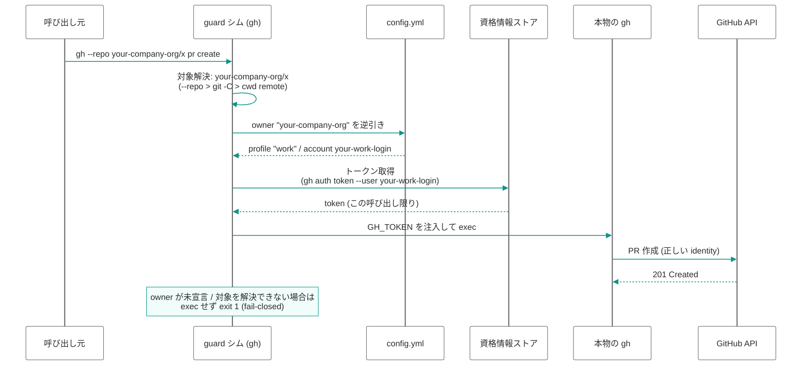
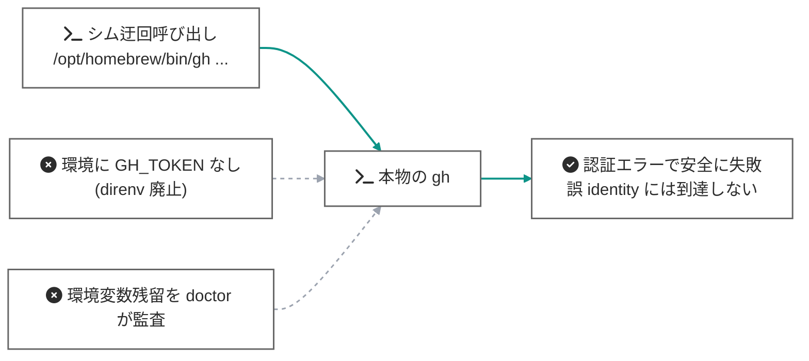

# enforce + fail-closed アーキテクチャ

[English version](enforce-fail-closed.md)

> **Status: 実装済み (v0.2.0)** — 本書は guard を「check 型」から「enforce 型」へ昇格させた設計の背景と理路を記録するものです。実装済みの仕様の正確なリファレンスは [docs/manual/ja/enforcement.md](../manual/ja/enforcement.md) を参照してください。スコープは identity のみ (汎用コマンドガードは作らない) という境界線を維持しています。
>
> 例に登場するアカウント名 (`your-oss-login` / `your-work-login`) と org 名 (`your-company-org`) はプレースホルダです。

## 1. 背景 — direnv 依存の 2 つの欠陥

v0.1.x までの構成では、`gh` アカウントの自動切替を direnv (`.envrc` の `GH_TOKEN` 注入) に委ねるのが定石でした。この方式には構造的な欠陥が 2 つあり、いずれも一次ソースで確認できます:

1. **非対話シェルで発火しない。** direnv はプロンプト表示時のシェルフックで動くため、自律エージェントの `bash -c ...` (rc 非読込) では `.envrc` が評価されません ([direnv/direnv#262](https://github.com/direnv/direnv/issues/262), [direnv man](https://direnv.net/man/direnv.1.html))。
2. **cwd 基準であり、操作対象基準ではない。** `gh --repo <owner>/<repo>` や `git -C <path>` で cwd と別の repo を操作すると、direnv も check 型 guard も cwd 側の identity を適用してしまいます。

さらに `gh` 自身も「pwd / git remote に基づく自動アカウント切替」を明示的にスコープ外としており ([cli/cli multiple-accounts.md](https://github.com/cli/cli/blob/trunk/docs/multiple-accounts.md))、active account はマシン全体で 1 つのグローバル状態です。この空白を gospelo-github-identity が埋めます。

### identity 3 層の整理

| 層 | identity の束縛先 | cwd がズレたときの挙動 |
|---|---|---|
| ① git 著者名 | 対象 repo の local `git config` | ✅ 守られる (`git -C X` は X の config を読む — [git docs](https://git-scm.com/docs/git)) |
| ② SSH push 認証 | 対象 repo の remote URL エイリアス + `IdentitiesOnly` | ✅ 守られる (鍵選択の入力は remote URL のみ) |
| ③ gh アカウント | **環境グローバル** (`GH_TOKEN` env / active account — [gh env manual](https://cli.github.com/manual/gh_help_environment)) | ❌ **穴** — 正しい repo に誤アカウントで write しうる |

本設計の目的は、**③ を ①② と同じ「対象に identity が紐づく」構造に揃える**ことです。

### 従来の穴 (cwd 基準 + direnv 依存)



## 2. 設計原則

1. **target-aware** — identity は cwd ではなく**操作対象** (`--repo` / `git -C` / 対象 repo の remote) から導出する。
2. **非 ambient** — 資格情報を環境変数として常駐させない。トークンは呼び出しごとに materialize し、その 1 プロセスの env にだけ一瞬存在する。
3. **fail-closed** — 対象を解決できない・profile を引けない・シムを迂回された、のいずれでも「誤 identity で通る」のではなく「認証なし / 実行拒否で失敗する」。

原則 3 が要石になります: PATH シムは迂回可能 (絶対パス実行、直接 API 呼び出し) ですが、**迂回した先に資格情報が存在しなければ**、迂回は「誤アカウントでの成功」ではなく「安全な失敗」に落ちます。検査の網羅性を諦める代わりに、検査を通らない経路から資格情報を消します。

## 3. アーキテクチャ全体図

guard は「検査して警告する check 型」から「identity を注入する enforce 型」へ昇格し、direnv は廃止できます (プロンプトフックへの依存が消える)。



## 4. データフロー

### 4.1 gh write の正常系 (target-aware 注入)

`gh --repo your-company-org/x pr create` を、無関係な cwd から実行した場合でも正しい identity で通す流れ:



### 4.2 シム迂回時 (fail-closed)

絶対パス実行やスクリプトからの直接呼び出しでシムを迂回しても、環境に資格情報が存在しないため「誤 identity での成功」には到達できません:



## 5. 穴の棚卸し — check 型 vs enforce 型

| 経路 | check 型 (direnv 併用, ~v0.1.x) | enforce 型 (v0.2.0+) |
|---|---|---|
| 非対話シェルからの `gh` write | ❌ direnv 非発火で素通り | ✅ PATH 経由なら必ずシムが強制 |
| cwd ズレ (`gh --repo X` / `git -C X`) | ❌ cwd 基準で誤判定 | ✅ 対象基準で解決 |
| 非 governed cwd からの操作 | ❌ profile 不一致でノーガード | ✅ 対象が governed なら強制、不明なら拒否 |
| 絶対パスでのシム迂回 | ❌ グローバル account で通る | ⭕ 資格情報がなく認証エラー (安全側) |
| 対象を推定できない操作 (`gh gist create`, `gh api /user` 等) | — | ✅ cwd の profile にフォールバック、非 governed なら拒否 |
| 資格情報ストアを直接読むプロセス | — | ⚠️ 残余リスク — OS サンドボックス / 専用ユーザーの領域 (スコープ外) |

① git 著者名・② SSH 鍵は既に target-local であり、本設計での変更はありません。

## 6. コンポーネント構成

| コンポーネント | 役割 |
|---|---|
| `guard.py` | 対象解決 (`--repo` / `-C` / 対象 remote) + owner→profile 逆引き + トークン注入 + fail-closed |
| `config.py` | profile の `gh:` の `owners:` (owner→profile の逆引きマップ) |
| `doctor.py` | fail-closed 状態の健全性チェック: `GH_TOKEN` / `GITHUB_TOKEN` が環境に常駐していないか |
| direnv (`.envrc`) | 廃止 (推奨セットアップから除外) |
| `switch` | 現状維持 (手動適用の一発コマンドとしての役割は不変) |

### 6.1 config (owners マップ)

```yaml
profiles:
  oss:
    git:
      user.name: your-oss-login
      user.email: you@example.com
    gh:
      account: your-oss-login
      owners: [your-oss-org, your-oss-login]   # この owner への write はこの profile
    paths:
      - ~/projects/oss/**
```

対象解決の優先順位: `--repo owner/name` 引数 → `git -C <path>` の対象 repo の remote → cwd の remote。owner がどの profile の `owners` にも見つからなければ**実行しません** (fail-closed)。

### 6.2 トークンの materialize

`gh auth token --user <account>` で対象 profile のトークンを取り出し、`GH_TOKEN` として本物の `gh` の実行環境にのみ注入します ([gh docs](https://github.com/cli/cli/blob/trunk/docs/multiple-accounts.md) が automated switching solutions 向けに案内している公式手段)。`GH_TOKEN` は保存済み認証情報より優先されるため、グローバル active account の状態に関わらず正しい identity で実行されます。

### 6.3 ambient credential の除去 (fail-closed の成立条件)

- シェル環境に `GH_TOKEN` / `GITHUB_TOKEN` を常駐させない (direnv 廃止で自動達成)
- 上記により「シムを通らない経路には資格情報がない」が成立する
- この規律は `doctor` が監査する (環境変数の残留を WARN で検出)

### 6.4 対象を推定できない操作のポリシー

`gh gist create` や `gh api /user` のように repo 対象を持たない操作は owner 逆引きができません。デフォルトは cwd の profile にフォールバックし、cwd も非 governed なら拒否します (`GOSPELO_GITHUB_IDENTITY_SKIP=1` で明示バイパス可)。

## 7. 移行パス

1. **Phase A — target-aware check**: guard の判定基準を cwd から対象へ (非破壊、既存挙動の精度向上)
2. **Phase B — トークン注入**: check 型 → enforce 型。direnv なしで正しい identity が選ばれる
3. **Phase C — ambient 除去**: direnv 廃止 + `doctor` の fail-closed 診断

Phase A/B は後方互換です (`gh.owners` を宣言しない限り従来の check 型のまま)。Phase C を完了した時点で fail-closed が成立します。

## 8. 残余リスクと限界 (正直な線引き)

- **資格情報ストア自体へのアクセス**は防げません。敵対的プロセスへの防御は OS サンドボックスの役割です。本設計が守るのは **accidental** な誤 identity です。
- gh の credential helper 経由の HTTPS git 認証はグローバル auth 前提のため、本設計は **SSH push 運用** (remote エイリアス + `IdentitiesOnly`) と組み合わせて成立します。
- `gh auth token --user` はアカウントが keyring にログイン済みであることが前提です。未ログインは `doctor` が検出し、guard は注入できない書き込みを拒否します。
- keyring のログイン済みアカウント自体は残るため (gh はログイン中アカウントのいずれかを常に active とする仕様)、doctor の ambient 監査は環境変数 (`GH_TOKEN` / `GITHUB_TOKEN`) の残留検査に限定しています。
