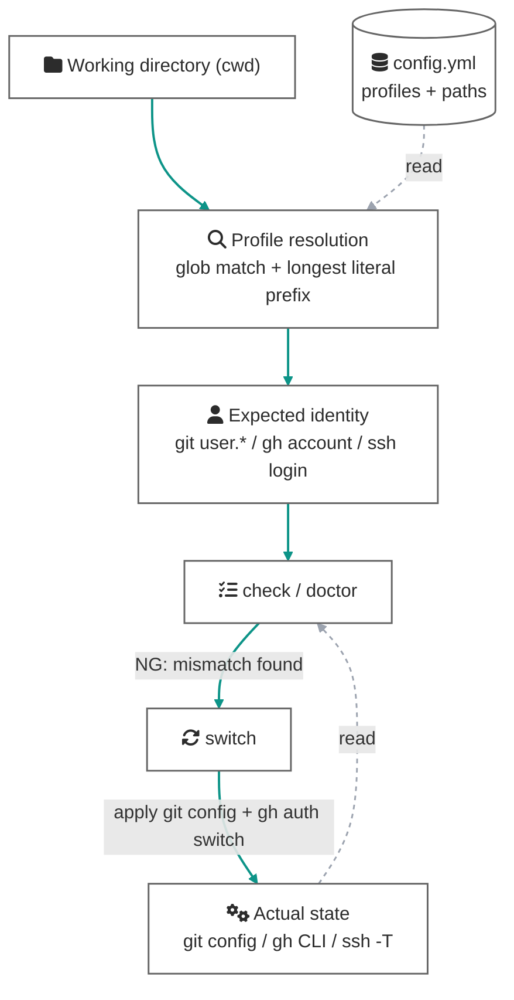

# Concepts

What gospelo-github-identity protects, and the model it uses to do so.

## The problem: identity lives in three separate layers

A write to GitHub actually involves three independent identities:

| Layer | Used for | Bound to |
|---|---|---|
| ① git author (`user.name` / `user.email`) | The Author field of commits | The repo's local `git config` (inherits global when unset) |
| ② SSH push authentication | Authenticating `git push` | The host (alias) in the remote URL + key settings in `~/.ssh/config` |
| ③ gh CLI account | API calls like `gh pr create` / `gh release` | **One active account per machine** |

The three layers switch independently, so it is easy to end up with ①② on your personal account while ③ is still your work account. Worse, ③ is global state: a `gh auth switch` run for another project silently leaks into your current work.

## The solution: make the directory the source of truth

gospelo-github-identity derives the expected identity from a single criterion: **where you are working**. You declare profiles (a bundle of expected git/gh/ssh identity) in `config.yml`, together with the directory globs (`paths`) each profile governs. Every command then resolves the profile from the cwd and verifies or applies it.

The resolution rules — when several profiles match, the pattern with the longest literal prefix wins; when nothing matches, `default_profile` applies if set, otherwise the directory is simply unmatched — are defined in [config-format.md](config-format.md#matching-rules).

## Three levels of defense

The same expected-vs-actual comparison is offered at three levels of increasing intervention:

### Level 1: visibility — `prompt` / `detect` / `check`

The layer a human reads. `prompt` keeps the profile name (and a mismatch marker `!`) in your shell prompt; `check` compares all three identity layers in a table. No side effects.

### Level 2: robustness audit — `doctor`

Where `check` asks "am I correct *right now*?", `doctor` asks "is the setup wired so it *stays* correct?". Even with `check` all green, setups like these break silently with a single unrelated action:

- git identity not pinned locally, **merely inherited from global** → breaks the moment global changes
- a remote using bare `git@github.com` → authenticates as whatever key ssh-agent offers first, so **a mere reorder of agent keys pushes as someone else**
- an SSH alias without `IdentitiesOnly yes` → a stray agent key can still be offered first
- the expected gh account not logged in at all → neither switch nor any automation can act as it

`doctor --sweep` audits every repository under the profile's `paths` in one pass, giving a tree-wide view of configuration rot.

### Level 3: enforcement — `guard` / commit-msg hook

The layer that works **while no human is watching**, aimed primarily at autonomous AI agents. `install-guard` shadows `gh` (and opt-in `git`) with PATH shims that enforce identity resolved from the **target of the operation** (`--repo` / `git -C` / the target repo's remote). With `gh.owners` declared, the profile reverse-mapped from the target owner has its token **injected per invocation** (enforce mode), making the machine-global active gh account irrelevant; writes targeting an owner no profile declares are refused before execution (fail-closed). The commit-msg hook strips `Co-Authored-By` trailers from every commit message. Details in [enforcement.md](enforcement.md); agent-oriented setup in [agents.md](agents.md).

Level 3 is what closes the hole in the table above — layer ③, "one gh account per machine": like ① and ②, ③ becomes **identity bound to the operation's target**.

## Scope and limits

- The threat model is **accidents** (wrong-identity writes). Defense against adversarial processes belongs to OS sandboxes and dedicated users, outside this tool's scope.
- PATH shims intercept **name-based** invocations only; an absolute path (`/usr/bin/git push`) bypasses them — but with no `GH_TOKEN` parked in the environment (a discipline `doctor` audits), bypass paths find no credentials and fail safely.
- Pinning push authentication assumes an **SSH workflow** (host-aliased remotes + `IdentitiesOnly yes`). `doctor` audits that this discipline is maintained.
- CI usage is not a goal: CI runs under a fixed bot account, so directory-derived verification is meaningless there.
