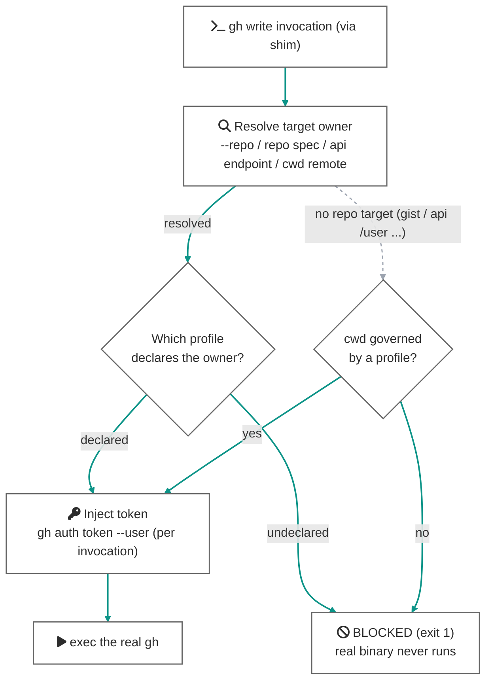

# Enforcement (guard / commit-msg hook)

`check` and `doctor` assume a human reads their output. The two mechanisms on this page work **while nobody is watching** — the layer aimed at autonomous AI agents (see [agents.md](agents.md)).

- **guard** — shadows `gh` / `git` with PATH shims and enforces identity resolved from the **target of the operation**
- **commit-msg hook** — removes prohibited trailers, then blocks so the user retries knowingly

## The guard (PATH shims for gh / git)

### Mechanics

`install-guard` writes tiny shell scripts named `gh` / `git` into a shim directory (default: `~/.gospelo-github-identity/bin`). With that directory at the front of `PATH`, every name-based invocation goes through the shim, which is just this one line:

```sh
exec gospelo-github-identity guard --tool gh --real /path/to/real/gh -- "$@"
```

Read-only commands always pass through (silently), `GOSPELO_GITHUB_IDENTITY_SKIP=1` is the explicit bypass, and without a usable config the guard governs nothing and passes through. Write commands are gated per tool as follows.

### gh writes: enforce mode (owners declared)

When any profile declares `gh.owners`, the guard runs in **enforce mode**. The criterion is the **target of the operation**, not the cwd:

1. **Resolve the target owner** — in priority order: the `--repo` / `-R` argument (`OWNER/REPO`, `HOST/OWNER/REPO`, or URL form) → the positional spec of `gh repo <action> OWNER/REPO` → a `repos/<owner>/...` segment in a `gh api` endpoint → the owner of the cwd repository's `origin` remote
2. **Reverse-map owner → profile** — look the owner up in each profile's `gh.owners` (case-insensitive)
3. **Inject the token** — materialize that profile's token with `gh auth token --user <account>` (keyring read only, no network) and inject it as `GH_TOKEN` into **that single invocation** of the real gh



Consequences of this structure:

- **Whatever the cwd**, `gh --repo gospelo-dev/x pr create` runs under the identity of the profile declaring gospelo-dev. A cwd/target mismatch — the classic agent pattern — is no longer an accident vector.
- **The machine-global active gh account stops mattering.** Someone running `gh auth switch` in another terminal cannot change which token gets injected; that follows from the target. Parking `GH_TOKEN` in the shell via direnv becomes unnecessary (together with its does-not-fire-in-non-interactive-shells defect).
- **A write targeting an owner no profile declares is refused before execution** (fail-closed). The fix is adding the owner to the config, or an explicit one-shot `GOSPELO_GITHUB_IDENTITY_SKIP=1`.
- Operations with no repo target (`gh gist create`, a POST to `gh api /user`, ...) fall back to the cwd's profile; when the cwd is ungoverned too, they are refused.

A token that cannot be materialized (the account was never `gh auth login`-ed) also blocks before execution.

### gh writes: check mode (no owners — backward compatible)

When no profile declares `gh.owners`, the guard runs in the legacy **check mode**: resolve the cwd's profile, compare what the active token actually is (`gh api user`) against the profile's `gh.account`, block on mismatch, pass ungoverned directories through with a notice. Existing configs keep working unchanged.

### git push: author check against the target repository

The identity a `git push` publishes is the commit author, so the **target repository's** local `git config` is what gets verified:

1. **Resolve the target repo** — compose `-C` flags with git's own semantics (multiple `-C` compose left-to-right; relative paths resolve against the running composition). Without `-C`, the cwd.
2. **Resolve the profile** — by the target repo's path against the `paths` globs; when the path is ungoverned and owners are declared, fall back to reverse-mapping the owner of the target's `origin` remote.
3. **Verify** — a `user.name` / `user.email` mismatch in the target repo **blocks**. A push to an undeclared owner (with owners declared) blocks too. Ungoverned targets pass through with a notice.

Just like `gh --repo`, a `git -C ~/work/repo push` run from a personal directory is judged by the **work repository's** configuration.

### What counts as a write

The classifier is conservative: **anything not listed passes through** (never breaking reads takes priority).

| Tool | Operations classified as writes |
|---|---|
| `git` | `push` only (global flags like `-C` / `-c` are skipped when locating the subcommand) |
| `gh release` | `create` `delete` `edit` `upload` `delete-asset` |
| `gh pr` | `create` `merge` `close` `edit` `review` `ready` `comment` `reopen` `lock` `unlock` |
| `gh repo` | `create` `delete` `edit` `archive` `unarchive` `rename` `sync` `set-default` `fork` |
| `gh issue` | `create` `close` `edit` `comment` `reopen` `delete` `transfer` `pin` `unpin` `lock` `unlock` |
| `gh gist` | `create` `delete` `edit` `rename` |
| `gh secret` / `gh variable` | `set` `delete` |
| `gh workflow` | `run` `enable` `disable` |
| `gh run` | `rerun` `cancel` `delete` |
| `gh label` | `create` `delete` `edit` `clone` |
| `gh cache` | `delete` |
| `gh api` | Any call with a non-GET/HEAD method (`-X POST` etc.) or field-style flags (`-f` / `-F` / `--field` / `--raw-field` / `--input`) |

### The fail-open / fail-closed boundary

The guard is designed around one line: **fail-closed inside the territory it was told to govern, fail-open everywhere else**:

| Situation | Behavior |
|---|---|
| Target owner declared in a profile's `owners` | Inject that profile's token and run (enforce) |
| Target owner declared by no profile | **Blocked** (fail-closed) |
| No resolvable target owner, cwd governed by a profile | Inject the cwd profile's token and run |
| No resolvable target owner, cwd ungoverned (owners declared) | **Blocked** (fail-closed) |
| Token cannot be materialized (not logged in) / identity undeterminable | **Blocked** (fail-closed) |
| Check mode (no owners), governed dir, identity mismatch | **Blocked** |
| Check mode, ungoverned directory | Passes through (notice: `not governed` — so a paths typo stays visible) |
| Config missing / unreadable | Passes through (notice: `no usable config`) |
| `GOSPELO_GITHUB_IDENTITY_SKIP=1` | Passes through (explicit bypass) |
| Read-only command | Always passes through (silently) |

Installing the shims therefore never breaks git/gh work on machines without a config, or (in check mode) in unmanaged directories.

### Shim bypasses and removing ambient credentials

A PATH shim intercepts **name-based** calls only; an absolute path (`/usr/bin/git push`) bypasses it. This is where the fail-closed keystone sits: **keep no `GH_TOKEN` / `GITHUB_TOKEN` parked in the shell environment** (retire direnv injection), and a bypassed path finds no credentials — the bypass degrades into an auth error, not a success under the wrong account.

`doctor` audits this discipline: a lingering `GH_TOKEN` / `GITHUB_TOKEN` in the environment is a WARN (it overrides the guard's injection and authenticates bypass paths); a clean environment is an OK. Accounts logged into the keyring do remain, so defense against a process that reads the credential store directly stays the job of OS sandboxing (the guard's scope is **accidents**).

### Output on a block

Identity mismatch (check mode / git author):

```
gospelo-github-identity guard: BLOCKED write under profile 'oss' — identity does not match.
  command : git -C /path/to/repo push
  mismatch: git user.name='someone-else' (expected 'your-oss-login')
  fix     : gospelo-github-identity switch oss
```

Undeclared owner (enforce mode):

```
gospelo-github-identity guard: BLOCKED gh write targeting owner 'stranger-org' — no profile declares this owner (fail-closed).
  command : gh pr create --repo stranger-org/tool
  fix     : add 'stranger-org' to the intended profile's gh.owners in ~/.config/gospelo-github-identity/config.yml,
            or bypass once with GOSPELO_GITHUB_IDENTITY_SKIP=1
```

### Environment variables

| Variable | Effect |
|---|---|
| `GOSPELO_GITHUB_IDENTITY_SKIP=1` | Explicit one-shot escape hatch: `GOSPELO_GITHUB_IDENTITY_SKIP=1 gh release create ...`. Also used internally to prevent recursion |
| `GOSPELO_GITHUB_IDENTITY_QUIET=1` | Suppresses the informational lines (`enforcing identity` / `passing through`). **Block notices are never suppressed** |

### install-guard

```bash
gospelo-github-identity install-guard                 # gh only (default)
gospelo-github-identity install-guard --tools gh,git  # also guard git push
```

- By default only `gh` is shadowed. Shadowing `git` adds Python startup latency to every git call and has a large blast radius, so it is opt-in (`--tools gh,git`). Commit-message hygiene is handled separately by the commit-msg hook.
- Change the shim directory with `--dir` (default: `~/.gospelo-github-identity/bin`).
- Before installing, the resolved `gospelo-github-identity` command is probed with `guard --selftest`; if a stale build without the `guard` subcommand sits on PATH, installation is **refused instead of producing broken shims** (exit 1).

Then put the shim directory at the **front** of `PATH`:

```bash
export PATH="$HOME/.gospelo-github-identity/bin:$PATH"   # add to ~/.zshrc / ~/.bashrc
command -v gh    # the shim path means the guard is active
```

If agents will use the machine, make sure the same `PATH` reaches the agent's launch environment (see [agents.md](agents.md)).

### uninstall-guard

```bash
gospelo-github-identity uninstall-guard
```

Removes the shim files. Delete the `export PATH=...` line from your shell rc yourself.

### Limitations

- A PATH shim intercepts name-based calls only; the safety of bypass paths rests on the ambient-credential discipline above. Tamper-resistance against adversarial processes belongs to OS sandboxes.
- The write classifier covers the table above; unknown subcommands pass through.
- Target-owner resolution reads `--repo` / repo specs / api endpoints / remotes. An operation that names its target some other way is judged by the cwd fallback.
- HTTPS git authentication through gh's credential helper presumes global auth, so pinning push identity holds together with an **SSH workflow** (aliased remotes + `IdentitiesOnly yes`), which `doctor` audits.

## The commit-msg hook (stripping Co-Authored-By)

On the principle that the human who runs the commit is the accountable author, the hook removes every `Co-authored-by:` and `Claude-Session:` trailer, then rejects the commit. The cleaned message file remains in place; review it and retry to complete the commit. This makes an unwanted attribution visible without allowing it into history.

It is a git hook rather than a PATH shim because:

- git funnels the **final** message — from `-m` / `-F` / the editor / `--amend` — through the `commit-msg` hook, so one hook covers every path
- the hook fires even when git is invoked by absolute path or from an IDE, because git itself runs it (no name-based shim gap)
- it runs only at commit time, adding no latency to every other git call

### install-commit-hook

```bash
gospelo-github-identity install-commit-hook [--dir DIR] [--force]
```

Installs a dispatcher into `--dir` (default: `~/.gospelo-github-identity/git-hooks`) and points the global `core.hooksPath` at it. After a clean message passes validation, the dispatcher **chains to each repository's own `.git/hooks/<name>`**, so existing hooks (husky, pre-commit, ...) keep working.

Caveats:

- When a global `core.hooksPath` is already set to a **different** value, installation is refused without `--force` (exit 1).
- A repository that sets its **own** `core.hooksPath` (husky et al.) overrides the global one, so this hook will not fire there. Wire it into that repo's hook setup individually if needed.

### uninstall-commit-hook

```bash
gospelo-github-identity uninstall-commit-hook
```

Unsets the global `core.hooksPath` (only when it points at our dispatcher) and removes the dispatcher files.

### strip-coauthors

```bash
gospelo-github-identity strip-coauthors <commit-msg-file>
```

The worker the hook invokes. It rewrites prohibited trailer lines in place and exits 1 so the user notices and retries with the cleaned message. I/O errors still exit 0 rather than blocking a commit on the hook's own failure.
