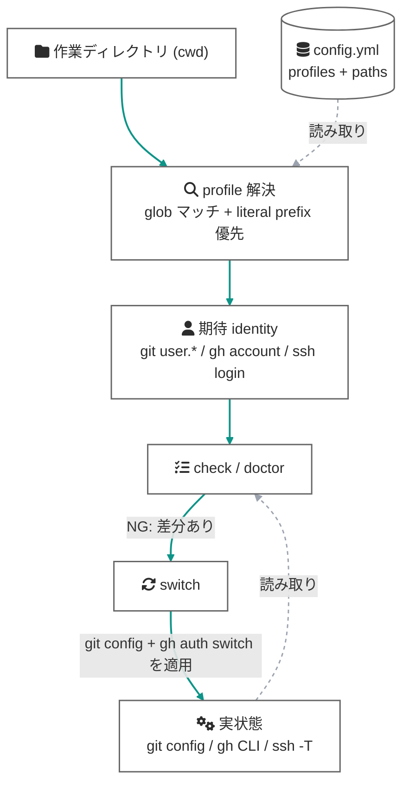

# コンセプト

gospelo-github-identity が守ろうとしているもの・仕組みの全体像です。

## 問題: identity は 3 つの層に分かれている

GitHub への書き込みには、実は独立した 3 つの identity が関わります:

| 層 | 何に使われるか | どこに束縛されるか |
|---|---|---|
| ① git 著者 (`user.name` / `user.email`) | コミットの Author 表記 | リポジトリの local `git config` (なければ global を継承) |
| ② SSH push 認証 | `git push` の認証 | remote URL のホスト (エイリアス) + `~/.ssh/config` の鍵設定 |
| ③ gh CLI アカウント | `gh pr create` / `gh release` 等の API 呼び出し | **マシン全体で 1 つ**のアクティブアカウント |

3 層は独立に切り替わるため、「①② は個人アカウントなのに ③ だけ業務アカウント」という混在が容易に発生します。しかも ③ はグローバル状態なので、別プロジェクトでの `gh auth switch` が現在の作業に黙って波及します。

## 解決: ディレクトリを identity の基準にする

gospelo-github-identity は「**どこで作業しているか**」を唯一の基準として期待 identity を決めます。設定ファイル `config.yml` に profile (期待される git/gh/ssh identity の組) と、その profile が支配するディレクトリの glob (`paths`) を宣言しておくと、各コマンドは cwd から profile を解決して照合・適用します。

profile の解決規則 (複数マッチ時は literal prefix が最長の pattern を持つ profile が勝つ、未マッチ時は `default_profile` があればそれ、なければ「未マッチ」) は [config-format.md](config-format.md#マッチング規則) に定義があります。

## 3 つの防御レベル

同じ「期待 vs 実状態」の照合を、介入の強さが異なる 3 レベルで提供します:

### レベル 1: 可視化 — `prompt` / `detect` / `check`

人間が目で確認するための層です。`prompt` はシェルプロンプトに profile 名 (と不一致マーカー `!`) を常時表示し、`check` は git / gh / ssh の 3 層をテーブルで照合します。副作用はありません。

### レベル 2: 堅牢性監査 — `doctor`

`check` が「**いま**正しいか」を見るのに対し、`doctor` は「正しさが**保たれる構成**か」を監査します。いま check が全部 OK でも、次のような構成は一つの操作で静かに壊れます:

- git identity が local に固定されておらず **global を継承しているだけ** → global を変えた瞬間に壊れる
- remote が素の `git@github.com` → ssh-agent が最初に差し出した鍵で認証されるため、**鍵の順序が変わるだけで別人 push** になる
- SSH エイリアスはあるが `IdentitiesOnly yes` がない → エージェントの別鍵が先に試されうる
- 期待する gh アカウントがそもそも未ログイン → switch も自動化も作動できない

`doctor --sweep` は profile の `paths` 配下の全リポジトリを一括監査し、構成の腐敗を俯瞰できます。

### レベル 3: 強制 — `guard` / commit-msg フック

人間が見ていなくても効く層で、AI エージェントの自律実行を主なターゲットにしています。`install-guard` は `gh` (opt-in で `git`) を PATH シムでシャドウし、書き込みの**操作対象** (`--repo` / `git -C` / 対象 repo の remote) から identity を解決して強制します。profile に `gh.owners` を宣言すると、対象 owner から逆引きした profile のトークンが**呼び出しごとに注入**され (enforce 型)、gh のグローバルなアクティブアカウントは無関係になります。どの profile にも属さない owner への書き込みは実行前に拒否されます (fail-closed)。commit-msg フックは全コミットメッセージから `Co-Authored-By` トレーラを除去します。詳細は [enforcement.md](enforcement.md)、エージェント観点のセットアップは [agents.md](agents.md) を参照してください。

このレベル 3 が、上の表で「③ gh CLI アカウントはマシン全体で 1 つ」だった穴を塞ぎます: ①② と同じく、③ も**操作対象に identity が紐づく**構造になります。

## 守備範囲と限界

- 守るのは**うっかり事故** (wrong-identity write) です。敵対的なプロセスへの防御は OS サンドボックス・専用ユーザーの領分で、このツールのスコープ外です。
- PATH シムは**名前ベース**の呼び出しだけを捕捉します。絶対パス (`/usr/bin/git push`) はバイパスされますが、環境に `GH_TOKEN` を常駐させない運用 (doctor が監査) にすれば、バイパス経路には資格情報がなく安全に失敗します。
- push 認証の固定は **SSH ワークフロー** (ホストエイリアス remote + `IdentitiesOnly yes`) を前提とします。`doctor` がこの規律の維持を監査します。
- CI での利用は想定していません。CI は固定の bot アカウントで動くため、ディレクトリ連動の照合に意味がないからです。
