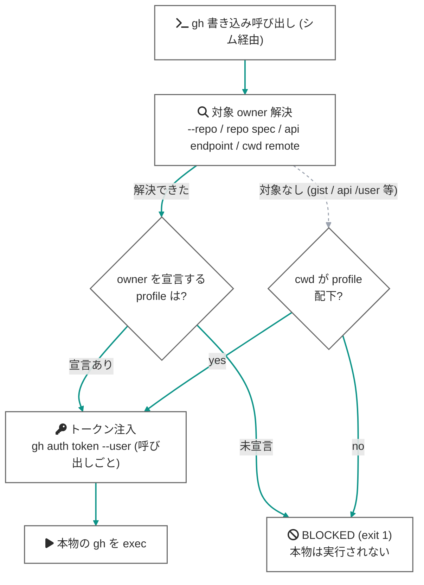

# 強制レイヤ (guard / commit-msg フック)

`check` / `doctor` は人間が読む前提の照合ですが、このページの 2 つの仕組みは**人間が見ていなくても**効きます。AI エージェントの自律実行を主なターゲットにした層です ([agents.md](agents.md) 参照)。

- **guard** — `gh` / `git` を PATH シムでシャドウし、書き込みの**操作対象**から identity を解決して強制する
- **commit-msg フック** — 全コミットメッセージから `Co-Authored-By` トレーラを除去

## guard (gh / git の PATH シム)

### 仕組み

`install-guard` は、シムディレクトリ (既定: `~/.gospelo-github-identity/bin`) に `gh` / `git` と同名の小さなシェルスクリプトを書き出します。このディレクトリを PATH の先頭に置くと、名前ベースの呼び出しがすべてシムを経由するようになります。シムは次の 1 行だけです:

```sh
exec gospelo-github-identity guard --tool gh --real /path/to/real/gh -- "$@"
```

読み取り専用コマンドは常に素通し (無音)、`GOSPELO_GITHUB_IDENTITY_SKIP=1` は明示バイパス、config が読めない環境では guard は何も統治せず素通しします。書き込みコマンドはツールごとに次のようにゲートされます。

### gh の書き込み: enforce 型 (owners 宣言時)

いずれかの profile が `gh.owners` を宣言していると、guard は **enforce 型**で動きます。判定基準は cwd ではなく**操作対象**です:

1. **対象 owner の解決** — 優先順に: `--repo` / `-R` 引数 (`OWNER/REPO`、`HOST/OWNER/REPO`、URL 形式) → `gh repo <action> OWNER/REPO` の位置引数 → `gh api` エンドポイント内の `repos/<owner>/...` → cwd リポジトリの `origin` remote の owner
2. **owner → profile 逆引き** — 解決した owner を各 profile の `gh.owners` から逆引き (大文字小文字は区別しない)
3. **トークン注入** — 逆引きした profile のトークンを `gh auth token --user <account>` で取り出し (keyring 読み取りのみ・ネットワークなし)、`GH_TOKEN` として**その 1 回の実行にだけ**注入して本物の gh を exec



この構造により:

- **cwd がどこであっても**、`gh --repo gospelo-dev/x pr create` は gospelo-dev を宣言する profile の identity で実行されます。cwd と操作対象のズレ (エージェントの典型パターン) が事故になりません。
- **gh のグローバルなアクティブアカウントは無関係**になります。別ターミナルで `gh auth switch` されても、注入されるトークンは対象から決まります。direnv による `GH_TOKEN` 常駐も不要になります (非対話シェルで発火しない欠陥ごと解消)。
- **どの profile も宣言していない owner への書き込みは実行前に拒否**されます (fail-closed)。修正は config への owner 追加、または `GOSPELO_GITHUB_IDENTITY_SKIP=1` での明示バイパスです。
- repo 対象を持たない操作 (`gh gist create`、`gh api /user` への POST 等) は cwd の profile にフォールバックし、cwd も統治外なら拒否します。

トークンが keyring にない場合 (そのアカウントで `gh auth login` していない) も、注入できないため実行前にブロックします。

### gh の書き込み: check 型 (owners 未宣言時 — 後方互換)

どの profile も `gh.owners` を持たない場合、guard は従来の **check 型**で動きます: cwd の profile を解決し、アクティブトークンの実体 (`gh api user`) を profile の `gh.account` と照合、不一致ならブロック、統治外ディレクトリは通知して素通しします。既存の設定ファイルはそのまま動きます。

### git push: 対象リポジトリの著者照合

`git push` で push される identity はコミット著者なので、**対象リポジトリ**の local `git config` を照合します:

1. **対象リポジトリの解決** — `-C` フラグを git と同じ規則で合成 (複数指定は左から合成、相対パスは合成途中に対して解決)。`-C` がなければ cwd。
2. **profile の解決** — 対象リポジトリのパスを `paths` glob で解決。パスが統治外で owners 宣言があるときは、対象の `origin` remote の owner から逆引き。
3. **照合** — 対象リポジトリの `user.name` / `user.email` が profile と不一致なら**ブロック**。未宣言 owner への push も (owners 宣言時は) ブロック。統治外はそのまま通知して素通し。

`gh --repo` と同様に、`git -C ~/work/repo push` を個人ディレクトリから実行しても**work リポジトリの設定**で判定されます。

### 何が「書き込み」と分類されるか

分類は保守的で、**リストにない操作はすべて素通し**です (読み取りを壊さないことを優先)。

| ツール | 書き込みと分類される操作 |
|---|---|
| `git` | `push` のみ (グローバルフラグ `-C` / `-c` 等はスキップしてサブコマンドを特定) |
| `gh release` | `create` `delete` `edit` `upload` `delete-asset` |
| `gh pr` | `create` `merge` `close` `edit` `review` `ready` `comment` `reopen` `lock` `unlock` |
| `gh repo` | `create` `delete` `edit` `archive` `unarchive` `rename` `sync` `set-default` `fork` |
| `gh issue` | `create` `close` `edit` `comment` `reopen` `delete` `transfer` `pin` `unpin` `lock` `unlock` |
| `gh gist` | `create` `delete` `edit` `rename` |
| `gh secret` / `gh variable` | `set` `delete` |
| `gh workflow` | `run` `enable` `disable` |
| `gh run` | `rerun` `cancel` `delete` |
| `gh label` | `create` `delete` `edit` `clone` |
| `gh cache` | `delete` |
| `gh api` | HTTP メソッドが GET / HEAD 以外 (`-X POST` 等)、または field 系フラグ (`-f` / `-F` / `--field` / `--raw-field` / `--input`) を含む呼び出し |

### fail-open / fail-closed の境界

guard は「**統治すると宣言された範囲では fail-closed、それ以外では fail-open**」という一線で設計されています:

| 状況 | 挙動 |
|---|---|
| 対象 owner が profile の `owners` にある | その profile のトークンを注入して実行 (enforce) |
| 対象 owner がどの profile にもない | **ブロック** (fail-closed) |
| 対象 owner を解決できず、cwd が profile 配下 | cwd の profile のトークンを注入して実行 |
| 対象 owner を解決できず、cwd も統治外 (owners 宣言時) | **ブロック** (fail-closed) |
| トークンを materialize できない (未ログイン) / identity を判定できない | **ブロック** (fail-closed) |
| check 型 (owners 未宣言) で profile 配下・identity 不一致 | **ブロック** |
| check 型で統治外ディレクトリ | 素通し (`not governed` を通知 — paths のタイポに気づけるように) |
| config 不在・読み取り不可 | 素通し (`no usable config` を通知) |
| `GOSPELO_GITHUB_IDENTITY_SKIP=1` | 素通し (明示的バイパス) |
| 読み取り専用コマンド | 常に素通し (無音) |

つまりシムを入れても、config を持たない環境や (check 型での) 管理対象外ディレクトリの git/gh 作業は壊れません。

### シム迂回と ambient credential の除去

PATH シムは**名前ベース**の呼び出ししか捕捉できず、絶対パス (`/usr/bin/git push`) はバイパスされます。fail-closed の要石はここです: **シェル環境に `GH_TOKEN` / `GITHUB_TOKEN` を常駐させない** (direnv の注入を廃止する) 運用にすれば、シムを迂回した先には資格情報がなく、迂回は「誤アカウントでの成功」ではなく「認証エラーでの安全な失敗」に落ちます。

この規律は `doctor` が監査します: 環境に `GH_TOKEN` / `GITHUB_TOKEN` が残っていれば WARN (guard の注入を上書きし、バイパス経路を認証してしまうため)、なければ OK を報告します。なお keyring にログイン済みのアカウント自体は残るため、資格情報ストアを直接読む敵対的プロセスへの防御は OS サンドボックスの領分です (guard の守備範囲は**うっかり**事故)。

### ブロック時の出力

identity 不一致 (check 型 / git 著者):

```
gospelo-github-identity guard: BLOCKED write under profile 'oss' — identity does not match.
  command : git -C /path/to/repo push
  mismatch: git user.name='someone-else' (expected 'your-oss-login')
  fix     : gospelo-github-identity switch oss
```

未宣言 owner (enforce 型):

```
gospelo-github-identity guard: BLOCKED gh write targeting owner 'stranger-org' — no profile declares this owner (fail-closed).
  command : gh pr create --repo stranger-org/tool
  fix     : add 'stranger-org' to the intended profile's gh.owners in ~/.config/gospelo-github-identity/config.yml,
            or bypass once with GOSPELO_GITHUB_IDENTITY_SKIP=1
```

### 環境変数

| 変数 | 効果 |
|---|---|
| `GOSPELO_GITHUB_IDENTITY_SKIP=1` | ゲートを 1 回バイパスする明示的な脱出ハッチ: `GOSPELO_GITHUB_IDENTITY_SKIP=1 gh release create ...`。guard 内部でも再帰防止に使用 |
| `GOSPELO_GITHUB_IDENTITY_QUIET=1` | `enforcing identity` / `passing through` 等の情報行を抑制。**ブロック通知は抑制されません** |

### install-guard

```bash
gospelo-github-identity install-guard                 # gh のみ (既定)
gospelo-github-identity install-guard --tools gh,git  # git push もガード
```

- 既定で `gh` のみをシャドウします。`git` のシャドウは毎回の git 呼び出しに Python 起動コストが乗り影響範囲も大きいため、opt-in です (`--tools gh,git`)。コミットメッセージの衛生は commit-msg フックが別途担当します。
- シム設置先は `--dir` で変更できます (既定: `~/.gospelo-github-identity/bin`)。
- インストール前に、解決された `gospelo-github-identity` コマンドが `guard --selftest` に応答するか検証し、`guard` を持たない古いビルドが PATH にある場合は**壊れたシムを作らずに拒否**します (exit 1)。

インストール後、シムディレクトリを PATH の**先頭**に追加します:

```bash
export PATH="$HOME/.gospelo-github-identity/bin:$PATH"   # ~/.zshrc / ~/.bashrc に追記
command -v gh    # シムのパスが表示されれば有効
```

エージェントに使わせる場合は、エージェントの起動環境にも同じ PATH が渡ることを確認してください ([agents.md](agents.md) 参照)。

### uninstall-guard

```bash
gospelo-github-identity uninstall-guard
```

シムファイルを削除します。シェル rc に追記した `export PATH=...` 行は手動で削除してください。

### 限界

- PATH シムは名前ベースの呼び出ししか捕捉しません。迂回経路の安全性は ambient credential の除去 (上述) に依存します。敵対的プロセスへの防御は OS サンドボックスの領分です。
- 書き込み分類は上表の範囲です。未知のサブコマンドは素通しします。
- 対象 owner の解決は `--repo` / repo spec / api エンドポイント / remote に基づきます。これらのいずれにも現れない形で対象を指定する操作は cwd フォールバックで判定されます。
- gh の credential helper 経由の HTTPS git 認証はグローバル auth 前提のため、push の identity 固定は **SSH ワークフロー** (エイリアス remote + `IdentitiesOnly yes`) と組み合わせて成立します (`doctor` が監査)。

## commit-msg フック (Co-Authored-By 除去)

コミットを実行した人間が責任を負う著者である、という方針のもと、`Co-authored-by:` トレーラ (AI の co-author 行など) を全コミットメッセージから除去します。

PATH シムではなく git フックで実装しているのは:

- `-m` / `-F` / エディタ / `--amend` のどの経路でも、git は**最終的なメッセージ**を `commit-msg` フックに通すため、1 つのフックで全経路をカバーできる
- フックは git 自身が起動するため、**絶対パス呼び出しや IDE からの commit でも発火**する (シムの名前ベース制約がない)
- commit 時のみ動くので、毎回の git 呼び出しにレイテンシが乗らない

### install-commit-hook

```bash
gospelo-github-identity install-commit-hook [--dir DIR] [--force]
```

`--dir` (既定: `~/.gospelo-github-identity/git-hooks`) にディスパッチャを設置し、global `core.hooksPath` をそこへ向けます。ディスパッチャは `Co-Authored-By` を除去した後、**各リポジトリ自身の `.git/hooks/<name>` にチェーン**するため、husky / pre-commit などの既存フックは動き続けます。

注意点:

- global `core.hooksPath` が**別の値**に既設の場合、`--force` なしでは拒否します (exit 1)。
- リポジトリが**独自の** `core.hooksPath` を設定している場合 (husky 等)、そちらが global 設定より優先されるため、このフックは発火しません。必要ならそのリポジトリのフック構成に個別に組み込んでください。

### uninstall-commit-hook

```bash
gospelo-github-identity uninstall-commit-hook
```

global `core.hooksPath` が自分のディスパッチャを指している場合のみ解除し、関連ファイルを削除します。

### strip-coauthors

```bash
gospelo-github-identity strip-coauthors <commit-msg-file>
```

フックが呼び出すワーカーです。メッセージファイルをその場で書き換えて `Co-authored-by:` 行を除去します。通常は直接実行しません。**常に exit 0** — 自身の I/O エラーでコミットをブロックしません。
